更新履歴

| 日付       | Version | 備考                              |
|------------|---------|-----------------------------------|
| 2025/12/10 | 1.0.0   | 第1版                             |

**本書について**

本書は、株式会社クリアコードが、PrintCancelerを御利用いただく管理者向けに作成した資料となります。2025年9月時点のデータにより作成されており、それ以降の状況の変動によっては、本書の内容と事実が異なる場合があります。また、本書の内容に基づく運用結果については責任を負いかねますので、予めご了承下さい。

本書で使用するシステム名、製品名は、それぞれの各社の商標、または登録商標です。なお、本文中ではTM、®、©マークは省略しています。

\newpage
# PrintCanceler概要

## PrintCancelerとは

Webページ中に設置された印刷ボタン、およびPDFファイルのプレビュー画面での印刷操作以外で、ユーザーが任意にWebページの印刷を試みた場合に、印刷ダイアログを自動でキャンセルし印刷を禁止するソリューションです。
システム上印刷を意図されていないWebページの印刷の抑止を目的としています。　

\newpage
# システム要件

## 概要

PrintCancelerが対応しているWindowsシステムについて、記述します。

## 動作サポートOS

**クライアント系OS**

- **Windows 11**
- **Windows 10**

いずれの場合も、Active Directoryドメインに参加済みの状態である必要があります。

## 動作サポート ブラウザー

- **Microsoft Edge 117 およびそれ以降**

\newpage
# インストール手順

## PrintCancelerインストールについて

PrintCancelerを利用するために、別途ランタイムライブラリー(.NET Framework等)の追加インストールは必要ありません。

## インストール方法

**PrintCancelerのセットアップ用のインストーラーは2種類あります。**  
**御利用されるWindows環境に合わせてセットアップファイルを選択してください。**

* Windows 64bit(x64)環境用  
  * **PrintCancelerSetup_x64.exe**

* Windows 32bit(x86)環境用  
  * **PrintCancelerSetup_x86.exe**

Windows環境に合っていないセットアップファイルを実行すると以下のメッセージが表示されます。

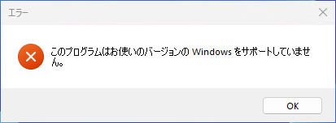

> このプログラムはお使いのバージョンの Windows をサポートしていません。

対処方法：PrintCancelerSetup_x64.exe または PrintCancelerSetup_x86.exe のうち、環境に合う物を利用してください。

### Windows 11(64bit)、Windows 10(64bit)環境のセットアップ例

1. PrintCancelerSetup_x64.exeを実行します。

    **■管理者権限で実行してください。**

    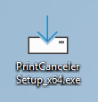  

2. 「次へ」ボタンをクリックします。

    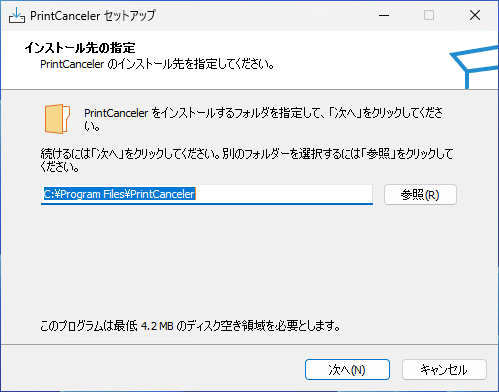  
    ■インストール先を変更する場合は、「参照」ボタンよりインストール先を変更します。

3. 「インストール」ボタンをクリックします。

    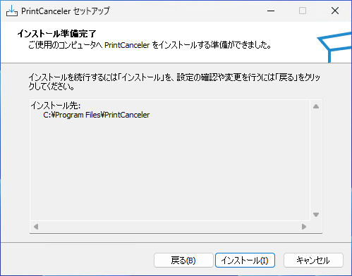

4. 「完了」ボタンをクリックします。

    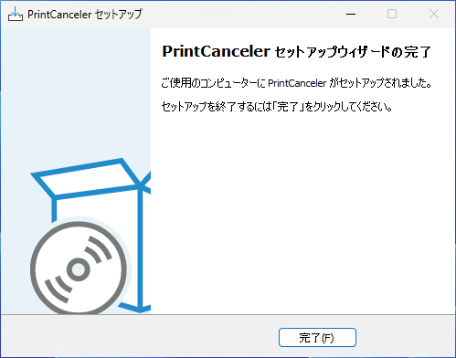

以上で、インストール作業は完了です。

\newpage
# アンインストール手順

## アンインストール方法 

1. コントロールパネルより「プログラムと機能」を表示します。  

    **■管理者権限で実行してください。**

    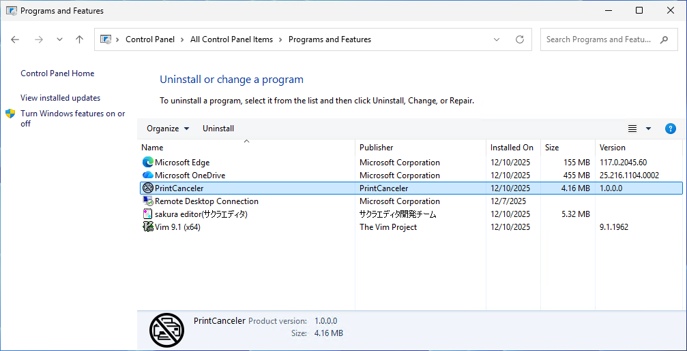

2. 一覧より「PrintCanceler」を選択しダブルクリックします。

    

3. 「はい」ボタンをクリックします。

    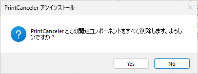

4. アンインストールが完了するとメッセージが表示されます。  

    [OK]をクリックします。

    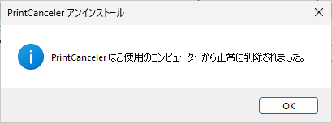

5. `<インストール先>\PrintCanceler`フォルダーを削除します。

    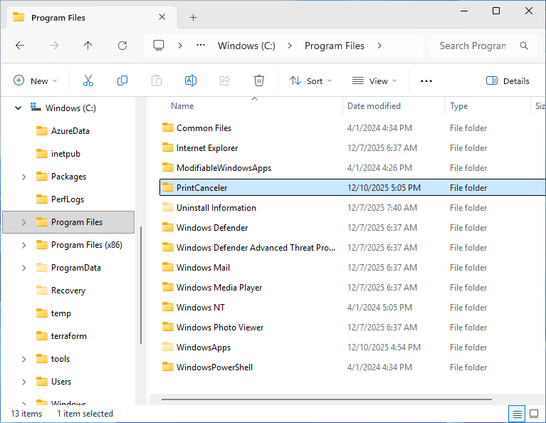

以上で、アンインストールは完了です。

\newpage
# サイレント インストール手順（自動インストール）

## PrintCancelerサイレント インストールについて

PrintCancelerのインストールをサイレント実行するための手順について記載します。

1.  応答ファイルの作成  

    **■デフォルト値でのサイレントインストールの場合は応答ファイルの作成は不要です。**

2.  サイレント インストールによるSetupの実行.

    **■管理者権限での実行が必要です。**

## 応答ファイルの作成

1. メモ帳を起動し`PrintCanceler.inf`ファイルを作成します。

    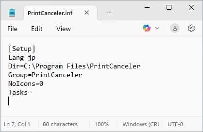

2. メモ帳に設定値を記述します。  

    インストール先とスタートメニューフォルダー名がカスタマイズ可能です。

    * インストール先: Dir
    * スタートメニューフォルダー名: Group

    ```
    [Setup]
    Lang=jp
    Dir=C:\Program Files\PrintCanceler
    Group=PrintCanceler
    NoIcons=0
    Tasks=
    ```

## サイレント インストール

### デフォルト値でのサイレント インストールの場合

**■デフォルト値でのサイレントインストールの場合は応答ファイルの作成は不要です。**

1. セットアップ用のEXEファイルに「/SP- /VERYSILENT」オプションを付与し実行します。  
  
    例) PrintCancelerSetup_x64.exe /SP- /VERYSILENT</p>

### 応答ファイルを利用したサイレント インストールの場合

1. セットアップ用のEXEファイルに「/SP- /VERYSILENT **/LOADINF="PrintCanceler.inf"**」オプションを付与し実行します。  

    例) PrintCancelerSetup_x64.exe /SP- /VERYSILENT /LOADINF="PrintCanceler.inf"

    ■応答ファイル PrintCanceler.infはSetupファイルと同一フォルダーに設置するかフルパスを指定します。

\newpage
# サイレント アンインストール手順（自動アンインストール）

## PrintCancelerサイレント アンインストールについて

PrintCancelerのアンインストールをサイレント実行するための手順について記載します。

**■管理者権限での実行が必要です。**  

**ログ関連のフォルダーや設定ファイル関連はアンインストール後に削除されません。**

## サイレント アンインストール

1. PrintCancelerセットアップ先にあるunins000.exeファイルに「/VERYSILENT」オプションを付与し実行します。  

    例) `"C:\Program Files\PrintCanceler\unins000.exe" /VERYSILENT`

\newpage
# バージョンアップ手順

## PrintCancelerバージョンアップについて

PrintCancelerのアンインストールの必要はありません。上書きインストールを行ってください。  

■マイナーバージョンアップの場合はアンインストールの必要はありません。

## バージョンアップ方法

**PrintCancelerのセットアップ用のインストーラーは2種類あります。**  
**御利用されるWindows環境に合わせてセットアップファイルを選択してください。**

* Windows 64bit(x64)環境用  
  * **PrintCancelerSetup_x64.exe**

* Windows 32bit(x86)環境用  
  * **PrintCancelerSetup_x86.exe**

Windows環境に合っていないセットアップファイルを実行すると以下のメッセージが表示されます。


> このプログラムはお使いのバージョンの Windows をサポートしていません。

対処方法：PrintCancelerSetup_x64.exe または PrintCancelerSetup_x86.exe のうち、環境に合う物を利用してください。

## Windows 11(64bit)、Windows 10(64bit)環境のセットアップ例

1. PrintCancelerSetup_x64.exeを実行します。  

    **■管理者権限で実行してください。**

    

2. 「インストール」ボタンをクリックします。

    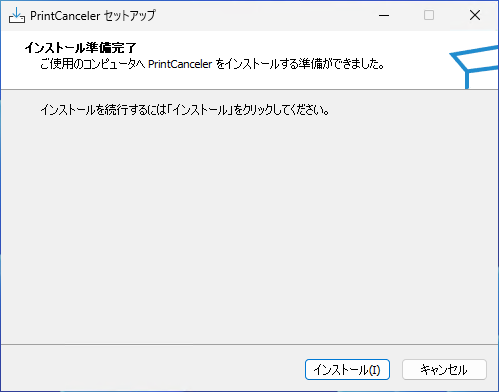

3. 「完了」ボタンをクリックします。

    

以上で、バージョンアップ作業は完了です。

\newpage
# Microsoft Edge PrintCanceler拡張導入手順

## Microsoft EdgeへのPrintCanceler拡張導入手順について

PrintCancelerのMicrosoft Edge用拡張機能は、Microsoft Edgeのアドオンストアからはインストールできません。
詳細は別添の「Microsoft Edge用PrintCanceler拡張機能　組織内サーバーを用いた配布・更新手順」を参照してください。

\newpage
# モジュール構成

## PrintCancelerモジュール構成

PrintCanceler インストーラーには以下のモジュールが含まれています。(合計 約15MB)

--------------------------------------------------------------------------------------
ファイル名                            サイズ           概要
------------------------------------- ---------------- --------------------------------
PrintCanceler.exe        約45KB           ダイアログキャンセルモジュール

`PrintCancelerHost\` \   約738KB          モダンブラウザー拡張連携
PrintCancelerTalk.exe

`PrintCancelerHost\` \   約1KB             Microsoft Edge拡張連携
edge.json
--------------------------------------------------------------------------------------

